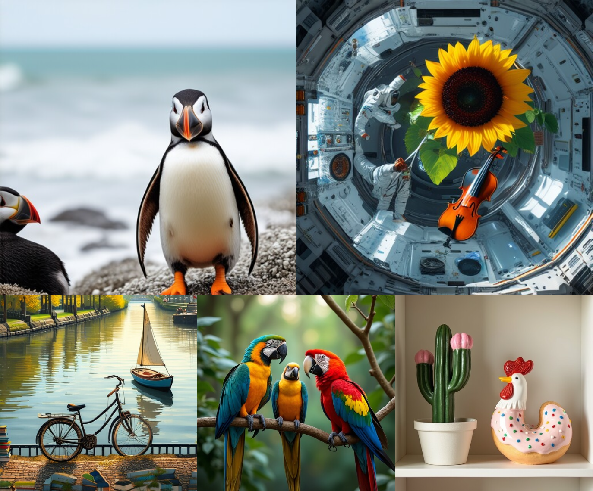
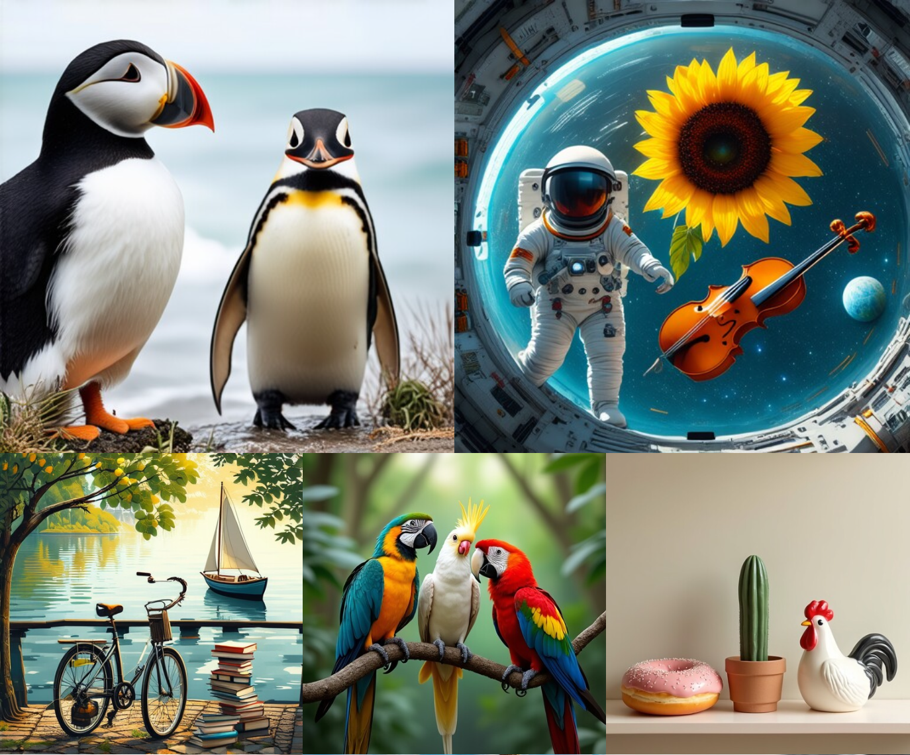

# FOCUS: A Principled Route to Multi‑Subject Fidelity

[](https://ericbill21.github.io/FOCUS/) [](https://arxiv.org/abs/2510.02315) [](https://huggingface.co/ericbill21/sd35_focus) [](https://huggingface.co/ericbill21/flux_focus) 

<p align="center">
  <a href="https://www.linkedin.com/in/ericbill21/">Eric Tillmann Bill</a>,
  <a href="https://enis.dev/">Enis Simsar</a>,
  <a href="https://da.inf.ethz.ch/people/ThomasHofmann">Thomas Hofmann</a>
</p>

> **Abstract.** Text-to-image (T2I) models excel on single-entity prompts but struggle with multi-subject descriptions, often showing attribute leakage, identity entanglement, and subject omissions. We introduce the first theoretical framework with a principled, optimizable objective for steering sampling dynamics toward multi-subject fidelity. Viewing **flow matching (FM)** through **stochastic optimal control (SOC)**, we formulate subject disentanglement as control over a trained FM sampler. This yields two architecture-agnostic algorithms: (i) a training-free **test‑time controller** that perturbs the base velocity with a single-pass update, and (ii) **Adjoint Matching**, a lightweight fine-tuning rule that regresses a control network to a backward adjoint signal while preserving base-model capabilities. The same formulation unifies prior attention heuristics, extends to diffusion models via a flow–diffusion correspondence, and provides the first fine-tuning route explicitly designed for multi-subject fidelity. Empirically, on Stable Diffusion 3.5, FLUX, and Stable Diffusion XL, both algorithms consistently improve multi-subject alignment while maintaining base-model style. Test-time control runs efficiently on commodity GPUs, and fine-tuned controllers trained on limited prompts generalize to unseen ones. We further highlight **FOCUS** (*Flow Optimal Control for Unentangled Subjects*), which achieves state-of-the-art multi-subject fidelity across models.

<p align="center">
  &nbsp; &nbsp; &nbsp; &nbsp; &nbsp; &nbsp; &nbsp; &nbsp;
  <b>Base Models</b>
  &nbsp; &nbsp; &nbsp; &nbsp; &nbsp; &nbsp; &nbsp; &nbsp; 
  &nbsp; &nbsp; &nbsp; &nbsp; &nbsp; &nbsp; &nbsp; &nbsp;
  &nbsp; &nbsp; &nbsp; &nbsp; &nbsp; &nbsp; &nbsp; &nbsp;
  <b>Base Models + FOCUS (Ours)</b><br>
  
  &nbsp; &nbsp; &nbsp; &nbsp; &nbsp; &nbsp; &nbsp; &nbsp;
  
</p>

## Highlights
- **Two ways to use FOCUS**
  - **Test‑time controller**: training‑free, perturbs the base sampler to encourage disentanglement.
  - **Adjoint Matching**: efficient fine‑tuning that learns a control network without degrading base capabilities.
- **Model‑agnostic**: demonstrated with SD3.5, FLUX, and SDXL.
- **Plug‑and‑play**: minimal changes to official pipelines; FOCUS controller is passed into the sampler.
- **Efficient**: test‑time control runs on commodity GPUs (≈12 GB VRAM works with memory‑saving modes).

---

## Installation

```bash
# Clone the repository
git clone https://github.com/ericbill21/FOCUS.git
cd FOCUS

# Install dependencies
pip install -r requirements.txt
```

> **Note:** The example notebooks rely on the official SD3 / FLUX pipelines with a small wrapper to accept the `Controller` object.

---

## Test‑Time Control

We provide two simple notebooks to run FOCUS **without changing model weights**:

- `sample_sd3_otf.ipynb` (Stable Diffusion 3.5)
- `sample_flux_otf.ipynb` (FLUX‑1 [dev])

Each pipeline is a lightly modified copy of the official implementation to accept a `Controller` that specifies the heuristic, λ (lambda), and subject indices.

```python
from focus.controller import Controller

controller = Controller(
    t5_ids=[[1], [5]],      # indices of prompt subjects in the T5 encoder
    clip_ids=[[2], [5]],    # indices of prompt subjects in the CLIP encoder
    lambda_scale=4.0,
    heuristic="focus",        # one of: "focus", "conform", "attend_and_excite", "divide_and_bind"
    model="SD3"            # "SD3" or "FLUX"
)

# Pass `controller` to the sampling pipeline in the notebook or your script.
```

**Tips**
- Set `lambda_scale=0` to disable the controller (baseline).
- Start with moderate λ (e.g., 1–5) and tune per prompt.
---

## Fine‑Tuning (Adjoint Matching)

We provide two training scripts (one per base model). Both follow the same logic.

### Effective Batch Size
Let **`num_traj`** be the number of trajectories per iteration and **`k`** the length (time steps) of each trajectory. The **effective batch size** is `num_traj × k`. We further sub‑sample time steps via `sub-start`, `sub-end`, and `sub-extra` to reduce memory and avoid overfitting.

### Common Arguments

| Group | Flag | Default | Description |
|---|---|---:|---|
| Setup | `--res-dir` | – | Directory to save results/checkpoints |
|  | `--dataset` | – | Path to a pre‑encoded dataset. We provided examples in `datasets/data_finetuning/` |
|  | `--ckpt-every` | 100 | Save a checkpoint every N iterations |
|  | `--verbose` | 1 | 0: warning, 1: info, 2: debug |
| Training | `--num-iterations` | 400 | Number of training iterations |
|  | `--learning-rate` | 1e-5 | Optimizer learning rate |
|  | `--dtype` | bfloat16 | Compute dtype (e.g., bfloat16, float32) |
| Scheduler / Solver | `--num-traj` | 5 | Trajectories sampled per iteration |
|  | `--k` | 28 | Time steps per trajectory |
|  | `--lambda-value` | 1.0 | λ in the reward/objective |
| Sub‑sampling | `--sub-start` | 0 | Start index for sub‑sampling time steps |
|  | `--sub-end` | 0 | End index for sub‑sampling time steps |
|  | `--sub-extra` | 5 | Additional random time steps |
| LoRA | `--lora-rank` | 4 | LoRA rank |
|  | `--lora-alpha` | 16 | LoRA α |
|  | `--lora-dropout` | 0.05 | LoRA dropout |
| Misc | `--seed` | 42 | Random seed |
|  | `--image-size` | 256 | Training image size |

### Example
```bash
python finetune_sd3.py \
  --dataset datasets/data_finetuning/example.yaml \
  --res-dir runs/sd3_focus \
  --num-iterations 200 --learning-rate 5e-5 \
  --num-traj 5 --k 28 --lambda-value 1.0 \
  --sub-start 0 --sub-end 0 --sub-extra 16 \
  --lora-rank 4 --lora-alpha 16 --lora-dropout 0.05 \
  --dtype bfloat16 --image-size 256 --seed 42
```

---

## Sampling Script (`sample.py`)
`sample.py` can generate images using **test‑time control**, **fine‑tuned weights**, or **both**. Disable the test-time controller by setting `--lambda-scale 0`.

### Key Arguments

| Group | Flag | Default | Description |
|---|---|---:|---|
| Paths | `--exp-dir` | images | Output directory |
|  | `--dataset` | (required) | Path to a dataset YAML of prompts. We provide examples in `datasets/` |
| Weights | `--path` | – | Path to fine‑tuned weights (optional) |
| Sampler | `--image-size` | 512 | Output resolution |
|  | `--num-steps` | model default | ODE/diffusion steps |
|  | `--guidance-scale` | model default | Classifier‑free guidance |
| Seeds | `--seed` | 0 | Single seed |
|  | `--seed-range` | – | Range `[a b]` to sweep multiple seeds |
| Controller | `--lambda-scale` | 1.0 | λ for controller; set `0` to disable |
|  | `--heuristic` | focus | One of {focus, conform, attend_and_excite, divide_and_bind} |
|  | `--model` | SD3 | Base model: {SD3, FLUX} |
| Memory | `--save-memory` | 0 | 0: none, 1: offload, 2: sequential offload, 3: + grad checkpointing |

### Example
```bash
python sample.py \
  --dataset datasets/natural_prompts.yaml \
  --exp-dir outputs/sd3_focus \
  --model SD3 --heuristic focus --lambda-scale 4 \
  --image-size 512 --seed-range 0 10
```

---

## Metrics & Evaluation
Use `eval_metrics.py` to compute all metrics reported in the paper.

1. Generate a set of images with `sample.py`.
2. Run `eval_metrics.py` on the produced images.
3. The script writes a CSV next to the image folder with **per‑image metrics**.

```bash
python eval_metrics.py \
  --data-dir outputs/sd3_focus \
  --batch-size 16
```

---

## Datasets
We provide all used datasets in the folder `datasets/`, which are simple YAML files, containing for each prompt, the subjects, and their corresponding T5 and CLIP indices. For the finetuning, we further provide already encoded versions of `datasets/two_objects.yaml` and `datasets/horse_bear.yaml`, in the folder `datasets/data_finetuning/`.

---

## Model Checkpoints
We plan to release the checkpoints of our best performing fine‑tuned models on Hugging Face. (In progress.)

---

## Troubleshooting
- **OOM / CUDA out of memory**: reduce `--image-size`, use `--save-memory 2` or `3`, or reduce `--k` / `--num-traj`.
- **No improvement from controller**: tune `--lambda-scale`, verify subject indices (`t5_ids`, `clip_ids`), and try alternative heuristics (`conform`, `attend_and_excite`, `divide_and_bind`).
- **Slow sampling**: decrease steps, enable memory‑saving modes, or disable gradient‑heavy options in notebooks.
---

## 📄 Citation
If you find our work useful, please consider citing:

```bibtex
@misc{bill2025focus,
  title         = {Optimal Control Meets Flow Matching: A Principled Route to Multi-Subject Fidelity},
  author        = {Eric Tillmann Bill and Enis Simsar and Thomas Hofmann},
  year          = {2025},
  eprint        = {2505.19166},
  archivePrefix = {arXiv},
  primaryClass  = {cs.CV}
}
```

---

**Questions or issues?** Please open a GitHub issue or reach out via the project website.
